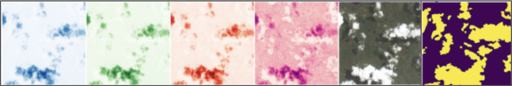
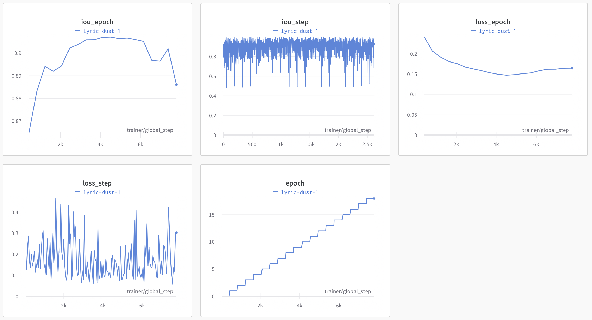

# Semantic Segmentation of Satellite Images to Identify Clouds
## Using a PyTorch CNN to spot clouds in order to ready satellite images for downstream analysis

## `Repo Organization`

* **`data_cleaning`**: notebook used to identify mislabeled chips and record them. Subdirectories `train_imgs_all_cloud_in_label` and `train_imgs_no_cloud_in_label` contain examples of the images that were said to be 100% or 0% cloud pixels. These were used to identify untrustworthy labels.

* **`example_data`**: images to represent the roughly 28 GB of images used in the project. You can access the full dataset using directions found [here](https://www.drivendata.org/competitions/83/cloud-cover/page/516/). 

* **`model`**: notebooks and `.py` file of helper functions used to achieve best results. Baseline models and the many other experiments in the project are omitted for brevity.

* **`planetary_computer_containers`**: technical files needed for environment setup

## Problem Description
According to NASA, only about 30% of the Earth’s land is completely free of clouds. This cloud cover presents a major challenge for satellite imagery analysis since clouds often obscure the land features we want to see. Such a hindrance can impede any number of tasks, from monitoring deforestation to estimating energy consumption. The goal of the project is to create an algorithm that can identify which pixels in a 512x512 pixel image are clouds and which are not clouds. I completed this project alongside two graduate student classmates as part of the Applied Machine Learning course from UC Berkeley’s Master’s of Information and Data Science program.

## Data
Microsoft’s Planetary Computer stores 10,986 “chips” from the European Space Agency’s Sentinel 2 satellites, comprising roughly 28 GB of data in total. Every chip contains multiple images, each capturing a certain bandwidth of light, for instance from the blue, green, red, and near infrared spectrums. These different bands can be combined to create a human-readable image. Additionally, each chip also came with a mask highlighting which pixels were cloud pixels and where were not.

## Solution

To identify clouds, we used PyTorch and its associated PyTorch Lightning library to create convolution neural network running in Microsoft’s Planetary Computer. A basic convolutional neural network using a U-Net archiecture and a ResNet34 pretrained backbone achieved a baseline Intersection over Union (IoU) score of 0.887 on the validation set, where IoU is the conventional performance metric for semantic segmentation.

To improve upon this baseline, we first cleaned the data, manually removing 762 chips with mislabeled masks. From there, we split the data into training, validation, and test sets and then conducted a series of experiments to find out which backbones, optimizers, schedulers, cost functions, and augmentations resulted in superior performance. We settled on Google’s Inception-v4 backbone, Adam optimizer, and the ColorJitter augmentation from Albumentations as alterations to the model that demonstrated the highest increased in performance. The modedl achieved an IoU of 0.907 on our validation set, a respectible improvement of 2.25% over the baseline. The execution of each model was captured by Weights and Biases, as shown below.

